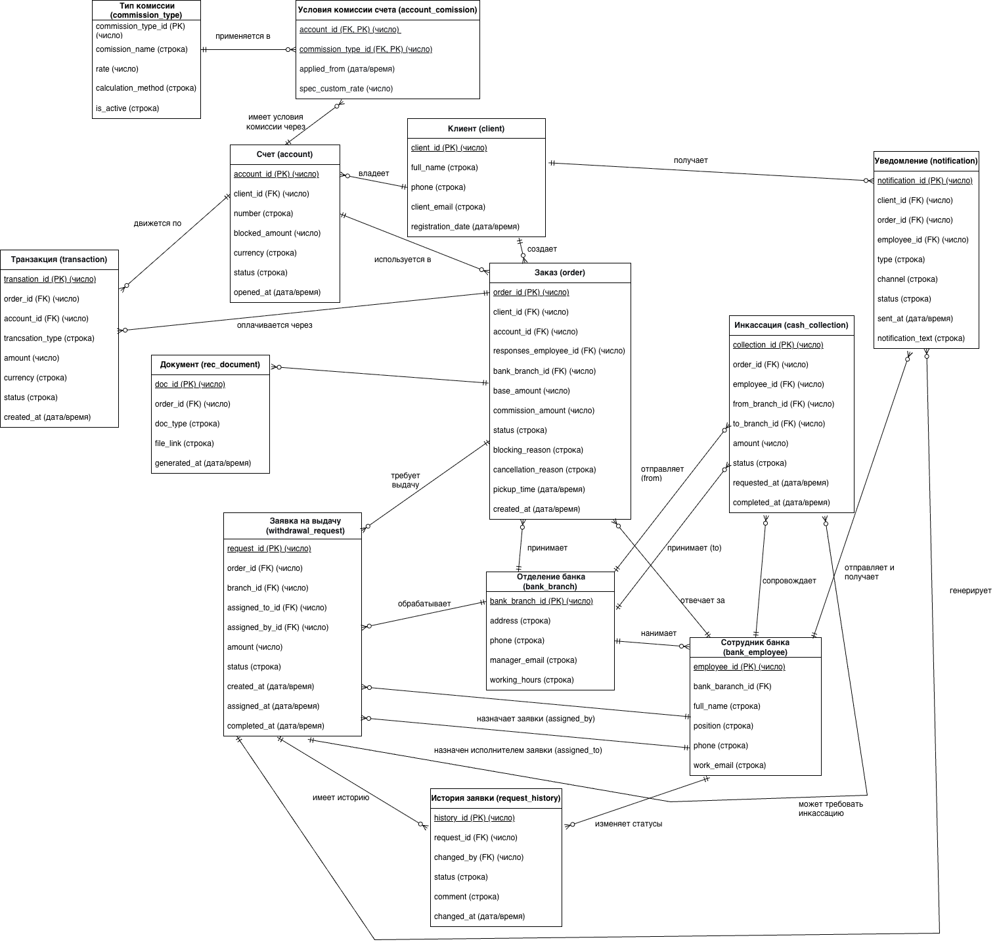

# Функциональные требования к системе учета банковских операций

## 1. Управление клиентами
Система должна хранить по каждому клиенту: уникальный идентификатор (`client_id`), полное имя (`full_name`), телефон (`phone`), электронную почту (`client_email`), дату и время регистрации (`registration_date`).

## 2. Управление счетами
Система должна хранить по каждому счету: уникальный идентификатор (`account_id`), идентификатор владельца (`client_id`), уникальный номер счета (`number`), валюту (`currency`), статус (`status`), дату открытия (`opened_at`), сумму заблокированных средств (`blocked_amount`).

## 3. Учет транзакций
Система должна хранить по каждой транзакции: уникальный идентификатор (`transaction_id`), идентификатор счета (`account_id`), идентификатор заказа (`order_id`), тип транзакции (`transaction_type`), сумму (`amount`), валюту (`currency`), статус (`status`), дату и время совершения (`created_at`).

## 4. Управление заказами
Система должна хранить по каждому заказу: уникальный идентификатор (`order_id`), идентификатор клиента (`client_id`), идентификатор счета списания (`account_id`), идентификатор отделения выдачи (`bank_branch_id`), идентификатор ответственного сотрудника (`responses_employee_id`), базовую сумму (`base_amount`), сумму комиссии (`commission_amount`), статус (`status`), причину блокировки (`blocking_reason`), причину отмены (`cancellation_reason`), секретный код (`secret_code`), дату создания (`created_at`), дату получения клиентом (`pickup_time`).

## 5. Управление заявками на выдачу
Система должна хранить по каждой заявке: уникальный идентификатор (`request_id`), идентификатор заказа (`order_id`), идентификатор отделения выдачи (`branch_id`), идентификатор сотрудника-исполнителя (`assigned_to_id`), идентификатор руководителя, назначившего заявку (`assigned_by_id`), сумму к выдаче (`amount`), статус (`status`), дату создания (`created_at`), дату назначения (`assigned_at`), дату выдачи (`completed_time`).

## 6. Аудит и история заявок
Система должна хранить по каждой записи истории заявки: уникальный идентификатор (`history_id`), идентификатор заявки (`request_id`), идентификатор сотрудника, изменившего статус (`changed_by`), новый статус (`status`), комментарий (`comment`), дату и время изменения (`changed_at`).

## 7. Управление документами
Система должна хранить по каждому документу: уникальный идентификатор (`doc_id`), идентификатор заказа (`order_id`), тип документа (`doc_type`), ссылку на файл (`file_link`), дату и время генерации (`generated_at`).

## 8. Управление уведомлениями
Система должна хранить по каждому уведомлению: уникальный идентификатор (`notification_id`), идентификатор клиента-получателя (`client_id`), идентификатор сотрудника-получателя (`employee_id`), идентификатор связанного заказа (`order_id`), тип (`type`), канал доставки (`channel`), статус доставки (`status`), текст (`notification_text`), дату и время отправки (`sent_at`).

## 9. Управление инкассацией
Система должна хранить по каждой инкассации: уникальный идентификатор (`collection_id`), идентификатор отделения-отправителя (`from_branch_id`), идентификатор отделения-получателя (`to_branch_id`), идентификатор ответственного сотрудника (`employee_id`), идентификатор связанного заказа (`order_id`), сумму (`amount`), статус (`status`), дату запроса (`requested_at`), дату выполнения (`completed_at`).

## 10. Управление комиссиями

### 10.1 Справочник типов комиссий
Система должна хранить по каждому типу комиссии: уникальный идентификатор (`commission_type_id`), наименование (`commission_name`), ставку (`rate`), метод расчета (`calculation_method`), признак активности (`is_active`).

### 10.2 Назначение комиссий на счета
Система должна хранить для каждой связки счет-тип комиссии: идентификатор счета (`account_id`), идентификатор типа комиссии (`commission_type_id`), дату начала действия (`applied_from`), индивидуальную ставку (`spec_custom_rate`).

## 11. Управление отделениями и сотрудниками

### 11.1 Отделения
Система должна хранить по каждому отделению: уникальный идентификатор (`bank_branch_id`), адрес (`address`), телефон (`phone`), email руководителя (`manager_email`), часы работы (`working_hours`).

### 11.2 Сотрудники
Система должна хранить по каждому сотруднику: уникальный идентификатор (`employee_id`), идентификатор отделения (`bank_branch_id`), ФИО (`full_name`), должность (`position`), телефон (`phone`), рабочую электронную почту (`work_email`).

## 12. Ключевые бизнес-правила

### Правило 1: Блокировка средств
Система должна блокировать сумму заявки на счете клиента в момент создания заявки, увеличивая `account.blocked_amount`, и не должна позволять списание заблокированных средств по другим операциям.

### Правило 2: Назначение исполнителя
Система должна проверять, что назначение заявки выполняет только руководитель отделения, требовать указания исполнителя (`assigned_to_id`) и назначившего (`assigned_by_id`), и не должна позволять выдачу заявки без назначения.

### Правило 3: Списание при выдаче
Система должна при закрытии заявки (шаг 10) создавать транзакцию списания, уменьшать `account.blocked_amount` на сумму выдачи и фиксировать дату и время выдачи (`completed_time`).

### Правило 4: Контроль доступа при выдаче
Система должна проверять, что заявку закрывает именно тот сотрудник, на которого она назначена. Система не должна позволять выдачу при несовпадении сотрудника.

### Правило 5: Полный аудит
Система должна фиксировать в истории каждое изменение статуса заявки, сохраняя: кто изменил, когда, на какой статус, комментарий. Система не должна позволять изменение или удаление записей истории.

---

# ER-диаграмма

---

# Описание базы данных банковской системы

## 1. Клиент (client)

| Поле | Тип данных | Описание | Ограничения |
|------|-----------|----------|-------------|
| client_id | число | Уникальный идентификатор клиента | PK, NOT NULL |
| full_name | строка | Полное имя клиента | NOT NULL |
| phone | строка | Номер телефона | NOT NULL |
| client_email | строка | Электронная почта | UNIQUE |
| registration_date | дата/время | Дата и время регистрации | NOT NULL |

## 2. Отделение банка (bank_branch)

| Поле | Тип данных | Описание | Ограничения |
|------|-----------|----------|-------------|
| bank_branch_id | число | Уникальный идентификатор отделения | PK, NOT NULL |
| address | строка | Адрес отделения | NOT NULL |
| phone | строка | Контактный телефон | NOT NULL |
| manager_email | строка | Email руководителя | NULL |
| working_hours | строка | Часы работы | NULL |

## 3. Сотрудник банка (bank_employee)

| Поле | Тип данных | Описание | Ограничения |
|------|-----------|----------|-------------|
| employee_id | число | Уникальный идентификатор сотрудника | PK, NOT NULL |
| bank_branch_id | число | Отделение, где работает | FK → bank_branch, NOT NULL |
| full_name | строка | ФИО сотрудника | NOT NULL |
| position | строка | Должность | NOT NULL |
| phone | строка | Контактный телефон | NOT NULL |
| work_email | строка | Рабочая электронная почта | UNIQUE |

## 4. Счет (account)

| Поле | Тип данных | Описание | Ограничения |
|------|-----------|----------|-------------|
| account_id | число | Уникальный идентификатор счета | PK, NOT NULL |
| client_id | число | Владелец счета | FK → client, NOT NULL |
| number | строка | Номер счета (видимый клиенту) | NOT NULL, UNIQUE |
| currency | строка | Валюта счета | NOT NULL |
| status | строка | Статус (активен, заблокирован, закрыт) | NOT NULL |
| opened_at | дата/время | Дата открытия счета | NOT NULL |
| blocked_amount | число | Сумма заблокированных средств | NOT NULL, DEFAULT 0 |

## 5. Транзакция (transaction)

| Поле | Тип данных | Описание | Ограничения |
|------|-----------|----------|-------------|
| transaction_id | число | Уникальный идентификатор транзакции | PK, NOT NULL |
| account_id | число | Счет, по которому движение | FK → account, NOT NULL |
| order_id | число | Связанный заказ | FK → order, NULL |
| transaction_type | строка | Тип: пополнение, списание, комиссия, блокировка, разблокировка | NOT NULL |
| amount | число | Сумма транзакции | NOT NULL |
| currency | строка | Валюта суммы | NOT NULL |
| status | строка | Статус: проведена, отменена, в обработке | NOT NULL |
| created_at | дата/время | Дата и время совершения | NOT NULL |

## 6. Заказ (order)

| Поле | Тип данных | Описание | Ограничения |
|------|-----------|----------|-------------|
| order_id | число | Уникальный идентификатор заказа | PK, NOT NULL |
| client_id | число | Клиент, создавший заказ | FK → client, NOT NULL |
| account_id | число | Счет для списания | FK → account, NOT NULL |
| bank_branch_id | число | Отделение выдачи | FK → bank_branch, NOT NULL |
| responses_employee_id | число | Ответственный сотрудник | FK → bank_employee, NULL |
| base_amount | число | Базовая сумма заказа | NOT NULL |
| commission_amount | число | Сумма комиссии | NOT NULL |
| status | строка | Статус заказа | NOT NULL |
| blocking_reason | строка | Причина блокировки | NULL |
| cancellation_reason | строка | Причина отмены | NULL |
| created_at | дата/время | Дата создания | NOT NULL |
| pickup_time | дата/время | Дата получения клиентом | NULL |

## 7. Заявка на выдачу (withdrawal_request)

| Поле | Тип данных | Описание | Ограничения |
|------|-----------|----------|-------------|
| request_id | число | Уникальный идентификатор заявки | PK, NOT NULL |
| order_id | число | Связанный заказ | FK → order, NOT NULL |
| branch_id | число | Отделение выдачи | FK → bank_branch, NOT NULL |
| assigned_to_id | число | Сотрудник-исполнитель | FK → bank_employee, NULL |
| assigned_by_id | число | Руководитель, назначивший заявку | FK → bank_employee, NULL |
| amount | число | Сумма к выдаче | NOT NULL |
| status | строка | Статус: создана, назначена, выдана, отменена | NOT NULL |
| created_at | дата/время | Дата создания | NOT NULL |
| assigned_at | дата/время | Дата назначения | NULL |
| completed_at | дата/время | Дата выдачи | NULL |

## 8. История заявки (request_history)

| Поле | Тип данных | Описание | Ограничения |
|------|-----------|----------|-------------|
| history_id | число | Уникальный идентификатор записи | PK, NOT NULL |
| request_id | число | Связанная заявка | FK → withdrawal_request, NOT NULL |
| changed_by | число | Сотрудник, изменивший статус | FK → bank_employee, NOT NULL |
| status | строка | Новый статус | NOT NULL |
| comment | строка | Комментарий | NULL |
| changed_at | дата/время | Дата и время изменения | NOT NULL |

## 9. Документ (rec_document)

| Поле | Тип данных | Описание | Ограничения |
|------|-----------|----------|-------------|
| doc_id | число | Уникальный идентификатор документа | PK, NOT NULL |
| order_id | число | Связанный заказ | FK → order, NOT NULL |
| doc_type | строка | Тип документа: чек, договор, акт | NOT NULL |
| file_link | строка | Ссылка на файл | NOT NULL |
| generated_at | дата/время | Дата генерации | NOT NULL |

## 10. Уведомление (notification)

| Поле | Тип данных | Описание | Ограничения |
|------|-----------|----------|-------------|
| notification_id | число | Уникальный идентификатор уведомления | PK, NOT NULL |
| client_id | число | Получатель-клиент | FK → client, NULL |
| employee_id | число | Получатель-сотрудник | FK → bank_employee, NULL |
| order_id | число | Связанный заказ | FK → order, NULL |
| type | строка | Тип уведомления | NOT NULL |
| channel | строка | Канал: sms, email, push | NOT NULL |
| status | строка | Статус доставки | NOT NULL |
| notification_text | строка | Текст уведомления | NOT NULL |
| sent_at | дата/время | Дата отправки | NOT NULL |

## 11. Инкассация (cash_collection)

| Поле | Тип данных | Описание | Ограничения |
|------|-----------|----------|-------------|
| collection_id | число | Уникальный идентификатор инкассации | PK, NOT NULL |
| from_branch_id | число | Отделение-отправитель | FK → bank_branch, NOT NULL |
| to_branch_id | число | Отделение-получатель | FK → bank_branch, NOT NULL |
| employee_id | число | Ответственный сотрудник | FK → bank_employee, NOT NULL |
| order_id | число | Связанный заказ | FK → order, NULL |
| amount | число | Сумма инкассации | NOT NULL |
| status | строка | Статус: запланирована, в пути, выполнена | NOT NULL |
| requested_at | дата/время | Дата запроса | NOT NULL |
| completed_at | дата/время | Дата выполнения | NULL |

## 12. Тип комиссии (commission_type)

| Поле | Тип данных | Описание | Ограничения |
|------|-----------|----------|-------------|
| commission_type_id | число | Уникальный идентификатор | PK, NOT NULL |
| commission_name | строка | Наименование комиссии | NOT NULL |
| rate | число | Ставка комиссии | NOT NULL |
| calculation_method | строка | Метод расчета: процент, фикс | NOT NULL |
| is_active | булево | Признак активности | NOT NULL |

## 13. Условия комиссии счета (account_commission)

| Поле | Тип данных | Описание | Ограничения |
|------|-----------|----------|-------------|
| account_id | число | Идентификатор счета | FK → account, PK |
| commission_type_id | число | Идентификатор типа комиссии | FK → commission_type, PK |
| applied_from | дата/время | С какого числа действует | NOT NULL |
| spec_custom_rate | число | Индивидуальная ставка | NULL |

---

# Пояснительная записка

## Функциональные требования, определившие структуру БД

Разработанная структура базы данных отражает ключевой бизнес-процесс системы — выдачу наличных клиенту в отделении банка.

**Ядро системы — заказ (order).** Он фиксирует всю основную информацию о заказе: кто клиент, с какого счета списываются деньги, в каком отделении будет выдача, какие отделения и сотрудники банка будут задействованы в данном процессе. От заказа строится вся логика: расчет комиссии (через справочник commission_type и связку account_commission), блокировка средств (поле blocked_amount в счете), создание заявки на выдачу (которая, в свою очередь, является центральной сущностью бизнес-процесса).

**Заявка на выдачу (withdrawal_request)** — через нее проходит жизненный цикл процесса: заказ создается, назначается руководителем на сотрудника, закрывается при выдаче. История заявки (request_history) идет в тесной связи с заявкой на выдачу (withdrawal_request) - сопровождает действия сотрудников и обеспечивает полный аудит каждого изменения статуса.

**Транзакции (transaction)** фиксируют все движения средств, при этом баланс счета не хранится, а вычисляется, что исключает рассинхронизацию данных. 

**Отделения (bank_branch) и сотрудники (bank_employee)** замыкают организационную структуру, позволяя назначать ответственных и контролировать исполнение.

---

## Изменения для расширения функциональности до "Заказ любых товаров с выдачей в отделении"

Если система будет расширяться до учета товарных заказов, потребуются следующие изменения:

- Создание таблицы `product` (product_id, name, description, price, weight) - для описания характеристик товаров
- Создание таблицы `order_item` (order_id, product_id, quantity, price) — заказ сможет содержать несколько позиций, поэтому структура таблицы заказоа должна так же усложниться
- Поле `base_amount` в заказе становится вычисляемым (сумма order_item.price * quantity), соотвественно оно будет нарушать нормальность реляционных таблиц - его нужно будет убрать
- Добавление таблицы `inventory` (branch_id, product_id, quantity) — если предполагается работа по типу ПВЗ маркетплейсов, где будут продавться множество видов разнородных физических товаров, потребуются специализированные склады, в которых будут вестись учет - сколько каких товаров в каждом отделении
- Также необходимо дополнительно продумать систему резервирования товаров при создании заявки (здесь трубуются уточнения со стороны бизнес-заказчиков)
- Заявка на выдачу (`withdrawal_request`) должна привязываться не только к деньгам, но и к товарам + потребуется таблица `withdrawal_request_item` (request_id, order_item_id, quantity), которая будет показывать, что именно выдается
- Инкассация (`cash_collection`) скорее всего преобразуется в службу доставки
- Потребуется создание новых таблиц: `product_category` — категории товаров, `supplier` — поставщики, `delivery_service` — службы доставки
- Изменится специфика статусов, которые существуют в состеме (в частности, появится необходимость оформления статусов, связанных с различными этапами сборки заказов)

